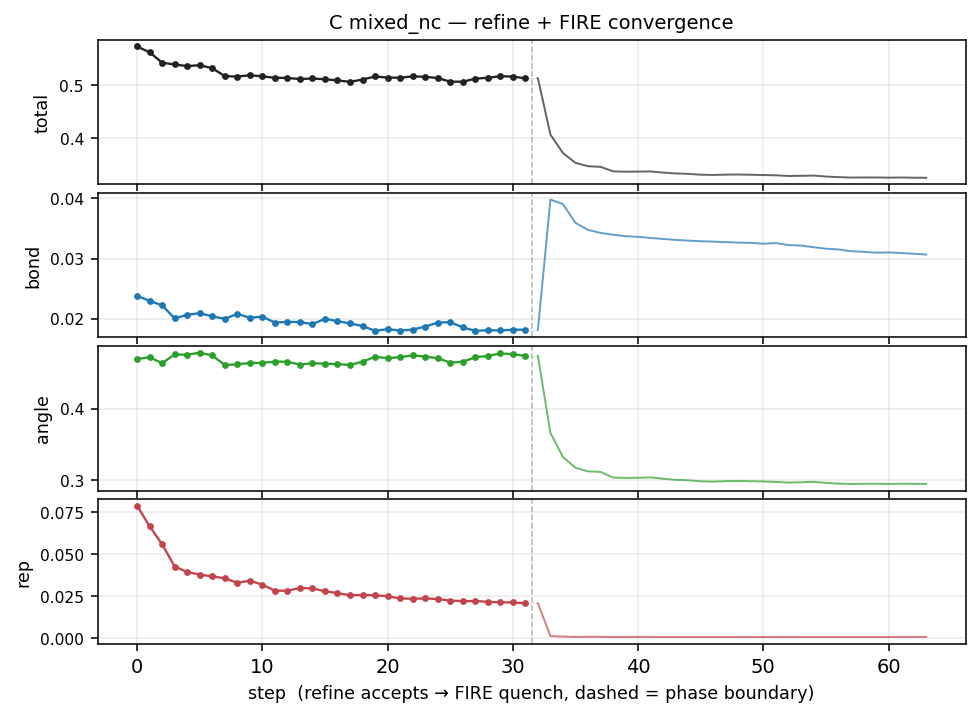

# Mixed sp²/sp³ nanocrystalline

C, 40 × 40 × 40 Å, regime preset `"mixed_nc"`. 50/50 mix of graphite and diamond grains. In every Voronoi cell either all atoms are sp² (graphite) or all atoms are sp³ (diamond); the two coexist as separate grains, with grain boundaries between sp² and sp³ patches.

## Orientation-refinement movie

Each frame is one accepted grain rotation; the schedule walks
30° → 15° → 5° → 2° and accepts the best of 50 trials per (amplitude,
grain).  Discrete steps, no FIRE between accepts.

<iframe src="../../_static/refined/trajectories/carbon_mixed_nc_refine.html"
        width="100%" height="600"
        style="border: 1px solid rgba(0,0,0,0.1); border-radius: 6px;"
        loading="lazy"></iframe>

## FIRE quench movie

Continuous atomic relaxation after rotation refinement.  sp³
tetrahedra are detected at the final state and rendered through
the playback (locked-index polyhedra following the trajectory).

<iframe src="../../_static/refined/trajectories/carbon_mixed_nc_fire.html"
        width="100%" height="600"
        style="border: 1px solid rgba(0,0,0,0.1); border-radius: 6px;"
        loading="lazy"></iframe>

## Cost trace: refinement + FIRE

Total / bond / angle / repulsion components.  Left of the dashed
line: rotation refinement (one point per accepted rotation).  Right:
FIRE convergence (downsampled).



## g3 distribution: initial · after refine · after FIRE

Three rooted three-body distributions captured at three points along
the pipeline so the algorithmic effect of each stage is visible.

**Initial** (post-build, post-retile): grain interiors are perfect
crystal slabs at random orientations.

<iframe src="../../_static/refined/g3/carbon_mixed_nc_initial.html"
        width="100%" height="520"
        style="border: 1px solid rgba(0,0,0,0.1); border-radius: 6px;"
        loading="lazy"></iframe>

**After refinement** (pre-FIRE): SO(3) coordinate descent has
walked each grain into a better-aligned basin against its
neighbours.  Differences from the initial g3 are concentrated at
grain boundaries.

<iframe src="../../_static/refined/g3/carbon_mixed_nc_after_refine.html"
        width="100%" height="520"
        style="border: 1px solid rgba(0,0,0,0.1); border-radius: 6px;"
        loading="lazy"></iframe>

**After FIRE** (final): all atoms relaxed.  A small post-FIRE
thermal jitter (σ scaled by regime grain density) is applied
before measurement so the peaks have realistic finite-T width
rather than the perfectly sharp 0K-FIRE-quench result.

<iframe src="../../_static/refined/g3/carbon_mixed_nc_after_fire.html"
        width="100%" height="520"
        style="border: 1px solid rgba(0,0,0,0.1); border-radius: 6px;"
        loading="lazy"></iframe>

## Code

```python
from ase.io import read
import tricor as tc

atoms_graphite = read("docs/structures/C_graphite.cif")
atoms_diamond  = read("docs/structures/C_diamond.cif")
shell_sp2 = tc.CoordinationShellTarget.from_atoms(atoms_graphite, phi_num_bins=90)
shell_sp3 = tc.CoordinationShellTarget.from_atoms(atoms_diamond,  phi_num_bins=90)
shell_target = tc.CoordinationShellTarget.from_targets(
    {"sp2": shell_sp2, "sp3": shell_sp3}
)

cell = tc.Supercell.from_atoms(
    atoms_graphite,
    cell_dim_angstroms=(40, 40, 40),
    r_max=10, r_step=0.1, phi_num_bins=90,
    rng_seed=42,
)
cell.generate(
    shell_target,
    grain_size=10.0,
    grain_sources=[
        {"atoms": atoms_graphite, "species_offset": 0, "weight": 0.5},
        {"atoms": atoms_diamond,  "species_offset": 1, "weight": 0.5},
    ],
    num_steps=120,
    bond_weight=2.0, angle_weight=1.0, repulsion_weight=2.0,
    hard_core_scale=0.9, nonbond_push_scale=0.8,
    displacement_sigma=0.03,
    refine_orientations=True,
    refine_orientations_kwargs=dict(
        amplitudes_deg=(30.0, 15.0, 5.0, 2.0),
        trials_per_amplitude_per_grain=50,
        max_rounds_per_amplitude=2,
        cost_function="pair_distance",
        score_cutoff_factor=1.5,
        time_budget_sec=180.0,
        capture_trajectory=True,
    ),
    capture_trajectory=True,
)
```
